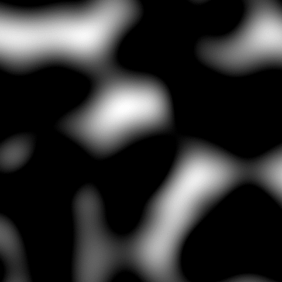

<a href="https://github.com/MustafaKhan670093/3D-Resnet-Research-UTMIST/blob/main/README.md#3d-resnets-research--utmist-">
    
</a>

# Daisy Hackathon 2021 🌼

Daisy Hackathon 2021 was a 24 hour programming challenge that took place between Jan. 9th to 10th, 2021. The objective was to create an intelligent agent that would win in a site location game that simulated the competitive environment of the retail sector. My team and I were finalists in this hackathon. 

This is the [pitch deck](https://docs.google.com/presentation/d/1EwO9AxeSVlUpmBd8_6m_L8CPLahBAYIsgrKj5uxdRUI/edit?usp=sharing) which explains our development process as well as how the algorithm we developed works and the following is a demo of our agent (in Red) making strategic plays in a ten move game.

<p align="center">
   
</p>

## Game overview

For retailers, choosing the ideal location to open a store is a difficult
process, in which they must consider a variety of factors such as:
- number of people close to the store
- nearby competitors
- how large a store to open

In this hackathon, you will code an AI that will play a simplified site
location game against other players. The structure of the game is as follows:

- A population distribution is created across a grid
- Each player is provided with a given amount of $
- For n rounds:
    - Each player chooses how many and of which type of stores to place on the 
      grid (all players choose simultaniously)
    - The population on the grid is assigned to each player based on a function
      considering distance and store attractiveness
    - Based on how much of the population visited a player's stores, the player
      receives an amount of $
    - The player loses an amount of $ based on the number and type of their 
      stores
- After all rounds are completed, the players are ranked based on the final 
  amount of $ they collected

Things to note:

- the grid is discrete
- the amount of money you have will limit the number and type of stores you will
  be able to place
- each round stores are placed simultaneously by all players

### Allocation function

- For each point on map
- calculate distance to every store on map
- for each point
  - calculate attractiveness of every store to that point
  - attractiveness is a function of distance and store type
  - attractiveness = max((store_quality / distance) - constant, 0)
  - for every player choose store with max attractiveness
  - assign population of that grid square to each player in proportion to that
    max attractiveness
  - if no player has > 0 attractiveness no store gets allocated the population

Things to note about this function:

- the same player stacking stores at the same location has no effect
- stores have a maximum radius outside of which they will not attract customers
- stores from different players that are nearby will share the customers between
  them

See `attractiveness_allocation` in `site_location.py`.

### Store types

There are three kinds of stores:

- small
  - low attractiveness
  - low cost
- medium
  - medium attractiveness
  - medium cost
- large
  - high attractiveness
  - high cost

See `DEFAULT_CONFIGURATION` in `site_location.py`.

## How to

### Requirements

Python 3.6 or higher. Required modules are found in `requirements.txt`.

In addition, the following modules will also be available and installed on the
game server should you find them useful in your solution:

- sklean
- pytorch
- keras

### Run examples

The script `site_location.py` contains all code needed to set up and run a game.

The script `example_players.py` contains some basic ai examples.

Provide a module name and class name to play classes against each other:

```
python site_location.py --players example_players:RandomPlayer example_players:RandomPlayer
```

This will play the specified players against each other, log results to the
screen and create a game report directory (by default in the current working
directory as "game").

## Competition 

The tournament structure will be as follows:

- Each team receives 5 entries

- Until 1 team remains:
  - Entries are randomly assigned to games of 5 players
    - it is unlikely that a team will play itself, but possible
    - some games may have `RandomPlayer`s added to ensure every game has 5 players
  - Each game is played, and a winner determined
  - All winners are advanced into the next round (if a team won multiple games,
    they will get multiple entries in the next round)

The overall winner will be the winning team from the final round.

Other teams will be ranked according to their scores in the final and previous rounds.

Practice tournaments will be run every 3 hours. The final tournament will occur
after the final submission deadline.

## Included software

[perlin_numpy](https://github.com/pvigier/perlin-numpy)
